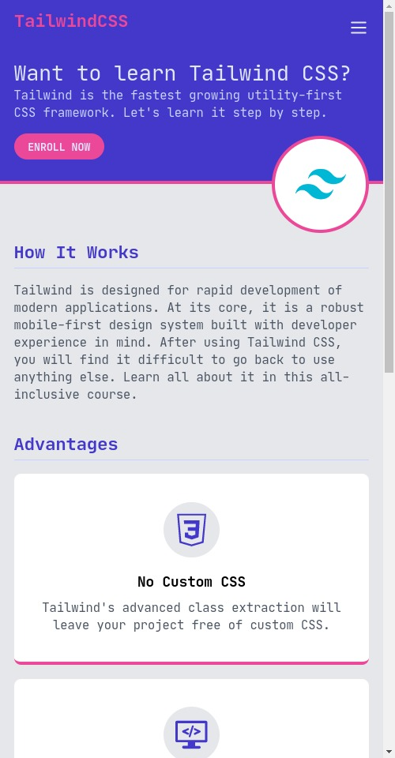

# Tailwind Practice

## Description

- The practice project that I made after finsihing a Tailwind course.
- Note: I think it makes the html hard to handle & read, but I heard it gets better when it's used in React.

#### Live demo

- [Check it out!](https://cryptic-deer.github.io/tailwind-landing-page/)

#### Built by using

- HTML, TailwindCSS
